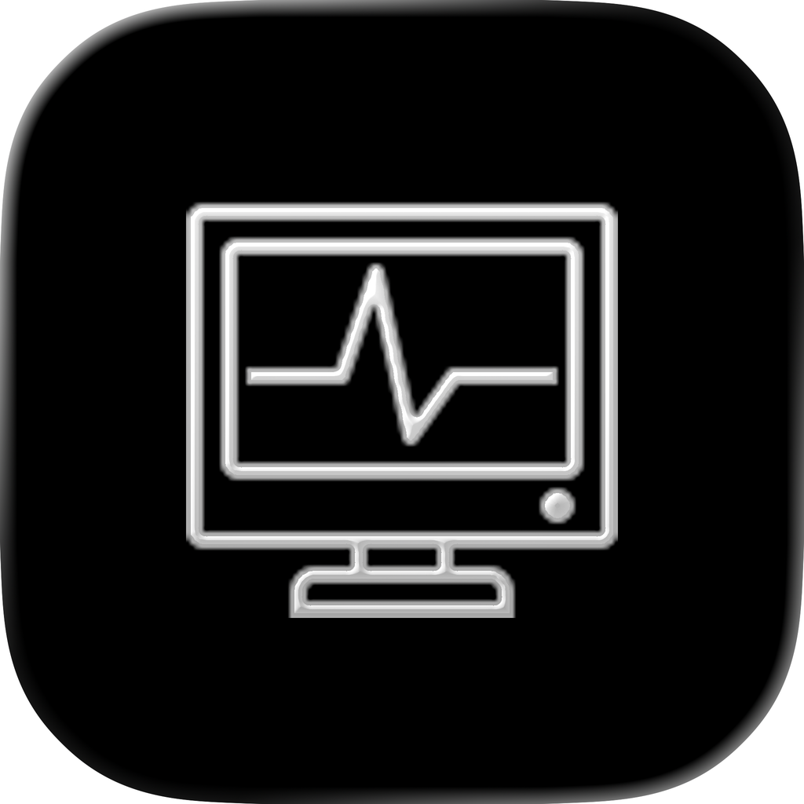
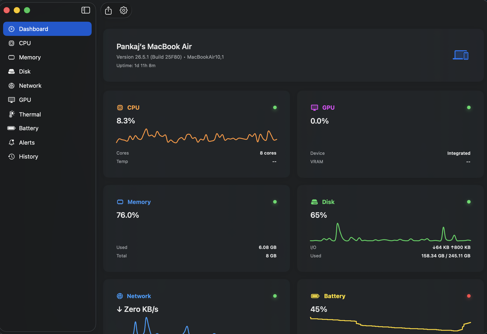
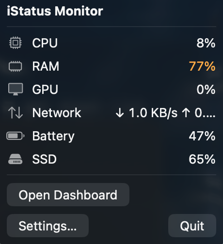
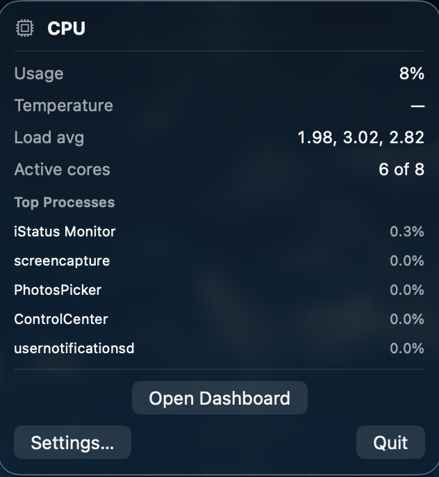
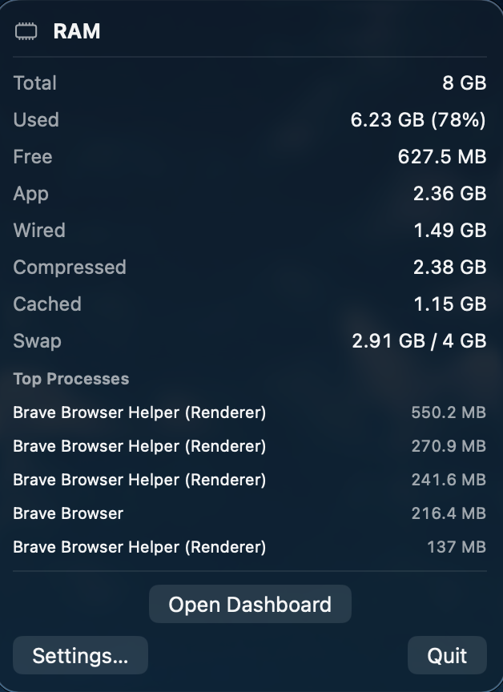
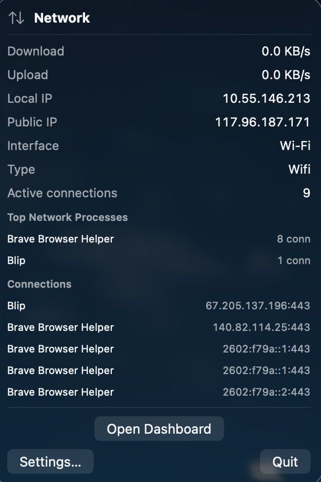
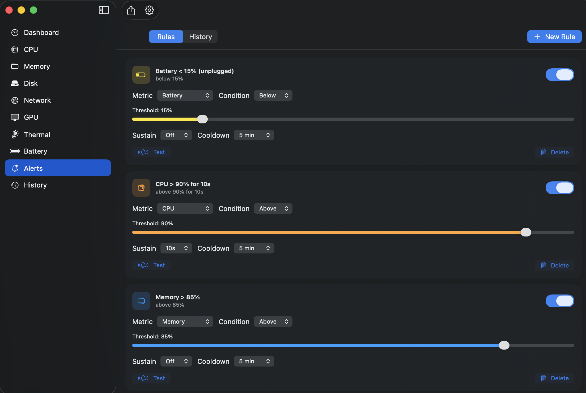
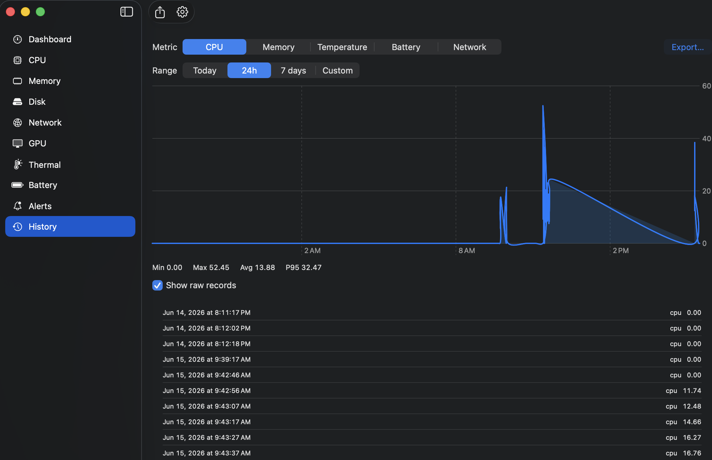
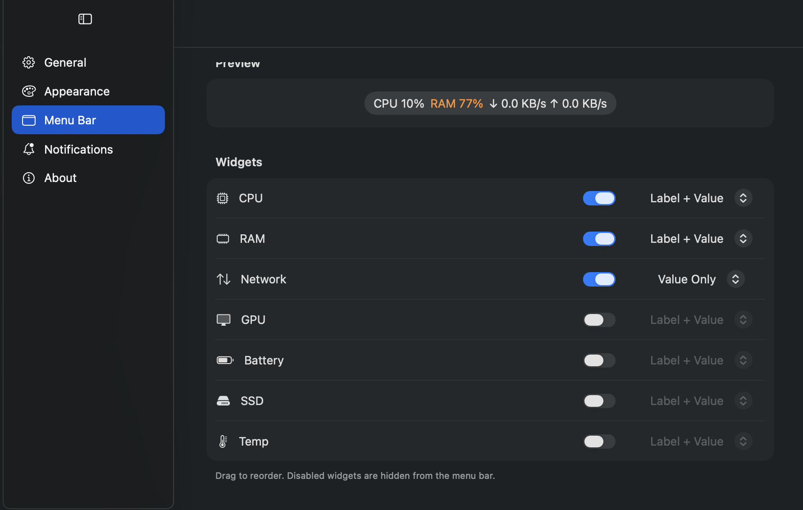

<div align="center">

#  iStatus Monitor

### A native macOS menu bar system monitor built with SwiftUI & SwiftData

[](https://github.com/PankajKrana/iStatus-Monitor/actions/workflows/macos-build.yml)
[](https://github.com/PankajKrana/iStatus-Monitor/actions/workflows/release.yml)
[](https://www.apple.com/macos/)
[](https://www.apple.com/macos/)
[](https://swift.org)
[](https://developer.apple.com/xcode/swiftui/)
[](https://support.apple.com/en-us/HT211814)
[](LICENSE)
[](https://github.com/PankajKrana/iStatus-Monitor/releases)

Live CPU, RAM, GPU, Network, SSD, Battery, and Thermal monitoring — directly from your macOS menu bar.
</div>

---

## ✨ Overview

**iStatus Monitor** is a lightweight, native macOS utility that keeps a real-time pulse on your Mac's hardware without ever getting in your way. It lives in the menu bar, runs continuously in the background, and surfaces a full dashboard only when you want it.

Built entirely with **SwiftUI**, **Swift Concurrency**, and **SwiftData**, it favors a modern, observation-driven architecture: a single monitoring loop feeds an observable state model, and every view — menu bar label, popover, and dashboard — derives from that one source of truth.

---

## 🚀 Features

### 📈 Metrics
- **CPU** — overall load, per-core usage, load averages, frequency (Intel), temperature
- **Memory (RAM)** — used / free / wired / compressed / cached, swap, app footprint
- **GPU** — utilization, VRAM, temperature
- **Network** — real-time up/down throughput, interface details, local & public IP
- **SSD / Disk** — capacity, used/free space, read/write speeds
- **Battery** — charge, health, cycle count, time remaining, temperature
- **Thermal** — sensor readings, fan RPM, thermal pressure state

### 🔍 Insights
- **Process insights** — top CPU- and memory-consuming processes
- **Network insights** — active connections, top network processes, and your public IP

### 🔔 Alerts & History
- **Threshold alerts** — per-metric rules (CPU, Memory, Temperature, Battery, Network) with warning/critical severity
- **Sustained triggering** — fire only after a condition holds for *N* seconds, to suppress transient spikes
- **Local notifications** — native banners via `UserNotifications`, plus an in-app alert history
- **Time-series history** — metrics persisted locally with **SwiftData** and charted as rolling sparklines

### 🧩 Menu Bar Experience
- **Compact mode** — a single combined status item with all enabled metrics
- **Per-module mode** — one independent menu bar item per metric, individually toggleable
- **Live, color-coded labels** — values shift color with severity (normal / warning / critical)
- **On-demand dashboard** — open the full window from any popover, close it without quitting

### ⚙️ System Integration
- 🪶 **Menu-bar-first** — no Dock icon (runs as an `LSUIElement` agent app)
- 🔄 **Background monitoring** — keeps running with all windows closed
- 🚀 **Launch at Login** — via the modern `SMAppService` API
- 💾 **History persistence** — metrics stored locally with **SwiftData**
- 🎨 **Customizable** — reorder widgets, choose display styles, pick layouts

---

## 🖼️ Screenshots

> All image assets live in [`docs/images/`](docs/images). See the
> [capture guide](docs/images/README.md) for the full screen-by-screen checklist.

### 🖥️ Dashboard

The full on-demand window — every monitored domain on one surface, live.



### 📊 Menu Bar

Lives in the menu bar in either **compact** (one combined item) or **per-module**
(one item per metric) mode, each with its own detail popover.

| Compact Mode | CPU & Memory | Network | Battery & Thermal |
| :---: | :---: | :---: | :---: |
|  |  |  |  |

### 🔔 Alerts

Threshold rules per metric (CPU, Memory, Temperature, Battery, Network) with
sustained-condition triggering and a local alert history.

<!-- Capture docs/images/alerts.png and uncomment this line — see docs/images/README.md

-->

### 📈 History

Locally persisted time-series, charted as rolling sparklines so you can see a
metric trend rather than just its current value.

<!-- Capture docs/images/history.png and uncomment this line — see docs/images/README.md

-->

### ⚙️ Settings

Reorder widgets, choose display styles, pick layouts, and toggle launch-at-login.



---
## 🏗️ Architecture Overview

iStatus Monitor uses a **single-source-of-truth, observation-driven** design. One background actor samples all hardware on a fixed interval and publishes to an `@Observable` state model; every UI surface re-renders automatically — no per-view timers, no duplicated state.

```text
                        ┌─────────────────────────────────────────────┐
                        │              iStatus_MonitorApp              │
                        │   (App entry · composition root · scenes)    │
                        └───────┬──────────────┬──────────────┬────────┘
                                │              │              │
                ┌───────────────▼──┐   ┌───────▼───────┐  ┌───▼────────────┐
                │   WindowGroup     │   │  MenuBarExtra │  │    Settings    │
                │  (Dashboard, on-  │   │  (compact +   │  │     scene      │
                │   demand window)  │   │  per-module)  │  │                │
                └───────────────┬──┘   └───────┬───────┘  └────────────────┘
                                │              │
                                ▼              ▼
                        ┌─────────────────────────────────┐
                        │     AppState  (@Observable)      │  ◄── single source of truth
                        │     live metrics + insights      │
                        └───────────────▲─────────────────┘
                                        │  applies snapshots (MainActor)
                        ┌───────────────┴─────────────────┐
                        │   SystemMonitorService (actor)   │  ◄── the only loop in the app
                        │   one tick → sample → publish    │
                        └───────────────┬─────────────────┘
              ┌────────────┬────────────┼────────────┬─────────────┐
              ▼            ▼            ▼            ▼             ▼
          ┌───────┐   ┌────────┐   ┌────────┐   ┌────────┐   ┌──────────┐
          │  CPU  │   │ Memory │   │ Network│   │  GPU   │   │ Battery… │   per-domain monitors
          └───────┘   └────────┘   └────────┘   └────────┘   └──────────┘
                                        │
                          ┌─────────────┼──────────────┐
                          ▼             ▼              ▼
                    ┌──────────┐  ┌────────────┐  ┌─────────────┐
                    │ DataStore│  │HistoryStore│  │ AlertEngine │
                    │  (actor) │  │ (SwiftData)│  │   (actor)   │
                    └──────────┘  └────────────┘  └─────────────┘
```

**Key principles**

- **One loop, one state.** `SystemMonitorService` is the sole sampling loop. It owns no UI; UI owns no timers.
- **Concurrency-safe by construction.** Monitors and stores are `actor`s; state is applied on the `@MainActor`.
- **Presentation derives from data.** `WidgetManager` computes menu bar segments from `AppState` + configuration via Observation — nothing is cached or duplicated.
- **Lifecycle is explicit.** As an agent app, the process outlives its windows (`applicationShouldTerminateAfterLastWindowClosed → false`); monitoring is tied to app lifetime, not the dashboard window.

```text
iStatus Monitor/
├── Core/                 # AppState, SystemMonitorService, DataStore, HistoryStore, AlertEngine
├── Features/
│   ├── CPU · RAM · GPU · Network · Disk · Battery · Thermal · Process
│   └── MenuBar/          # MenuBarExtra scenes, WidgetManager, renderer, settings
├── UI/
│   ├── Navigation/       # Dashboard shell, Settings
│   ├── Components/        # Per-metric views
│   ├── Charts/           # Sparklines, rolling time-series
│   └── Theme/
└── Resources/            # Assets, entitlements
```

---

## 🛠️ Installation (Build from Source)

```bash
# 1. Clone the repository
git clone https://github.com/PankajKrana/iStatus-Monitor.git
cd "iStatus-Monitor"

# 2. Open in Xcode
open "iStatus Monitor.xcodeproj"
```

Then, in Xcode:

3. Select the **iStatus Monitor** scheme.
4. Choose a destination (your Mac).
5. Press **⌘R** to build and run.

> 💡 The app launches into the menu bar (no Dock icon). Click the menu bar item and choose **Open Dashboard** to see the full window.

---

## 📦 Release Installation (DMG)

For most users — no Xcode required. Releases ship as a `.dmg` built automatically
from each `v*` tag by the [release workflow](.github/workflows/release.yml).

1. **Download** the latest `iStatus-Monitor-vX.Y.Z.dmg` from the [**Releases**](https://github.com/PankajKrana/iStatus-Monitor/releases) page.
2. **Open** the DMG and **drag** `iStatus Monitor.app` onto the **Applications** shortcut.

   > ⚠️ Launch at Login requires the app to live in a stable location. Always run it from `/Applications`, not from `~/Downloads` or a build folder.

3. **First launch — the app is not yet notarized.** Builds are currently
   **unsigned** (no Apple Developer ID), so Gatekeeper will block a normal
   double-click. To open it the first time:

   - **Right-click** (or Control-click) `iStatus Monitor.app` → **Open** → confirm **Open** in the dialog, **or**
   - if macOS still refuses, go to **System Settings → Privacy & Security**, scroll to the **Security** section, and click **Open Anyway** next to the iStatus Monitor warning.

   You only need to do this once. macOS remembers the approval for that copy of the app.

   <details>
   <summary>Alternative: clear the quarantine flag from Terminal</summary>

   ```bash
   xattr -dr com.apple.quarantine "/Applications/iStatus Monitor.app"
   ```

   This removes the download-quarantine attribute that triggers the Gatekeeper
   prompt. Only run it on a build you trust and downloaded yourself.
   </details>

4. **Enable Launch at Login**: click the menu bar item → **Settings… → General → Launch at login**.

That's it — iStatus Monitor will now start automatically and run quietly in your menu bar.

> 🔏 **Why unsigned?** Code signing and notarization require a paid Apple
> Developer ID. The release pipeline already has the signing/notarization hooks
> stubbed in ([`release.yml`](.github/workflows/release.yml)); once a certificate
> is available, signed + notarized DMGs will install without the steps above.

---

## 💻 Requirements

| Requirement | Version |
| --- | --- |
| 🍎 **macOS** | macOS 26 (Tahoe) or later |
| 🧰 **Xcode** | Xcode 26 or later (to build from source) |
| 🛠️ **Swift** | Swift 6 language mode (toolchain 6.x) |
| 💻 **Architecture** | Apple Silicon (arm64) |

> Apple Silicon is fully supported. Some metrics (e.g. nominal CPU frequency) rely on Intel-only sysctls and are gracefully omitted on M-series Macs.

---

## 🧑‍💻 Development

### Build

```bash
# Debug build
xcodebuild -project "iStatus Monitor.xcodeproj" \
  -scheme "iStatus Monitor" -configuration Debug build

# Release build
xcodebuild -project "iStatus Monitor.xcodeproj" \
  -scheme "iStatus Monitor" -configuration Release build
```

### Run Tests

```bash
xcodebuild test \
  -project "iStatus Monitor.xcodeproj" \
  -scheme "iStatus Monitor" \
  -destination 'platform=macOS'
```

The test suite (`iStatus MonitorTests/`) covers the monitoring service, CPU sampling, the alert engine, and SwiftData history persistence.

### Project Layout Conventions

- Each metric lives under `Features/<Domain>/` with its own monitor and snapshot model.
- Shared coordinators and persistence live in `Core/`.
- UI is split into `Navigation/`, `Components/`, `Charts/`, and `Theme/`.

---

## 🤝 Contributing

Contributions are welcome and appreciated! 🎉 Please read the full
[**Contributing Guide**](CONTRIBUTING.md) before opening a PR — it covers the
branch model (`main` / `develop` / `feature/*`), commit conventions, the pull
request process, coding standards, and testing requirements.

**Quick start:**

1. **Fork** the repository and branch from `develop`: `git checkout -b feature/my-feature`.
2. **Commit** your changes with clear, conventional messages.
3. **Test**: ensure `xcodebuild test` passes.
4. **Open a Pull Request** into `develop` describing the change and rationale.

Please keep PRs focused, match the existing architecture (single-source-of-truth, actor-isolated monitors), and add tests where it makes sense. For larger features, open an issue first to align on the approach.

Found a security issue? **Do not open a public issue** — see [`SECURITY.md`](SECURITY.md) for private disclosure instructions.

---

## 🔄 CI / CD

| Workflow | Trigger | Purpose |
| --- | --- | --- |
| [`macos-build.yml`](.github/workflows/macos-build.yml) | push to `develop`, PRs into `develop` / `main` | Build + run the full test suite on a `macos-26` runner (Xcode 26). |
| [`release.yml`](.github/workflows/release.yml) | push of a `v*` tag | Test → archive (Release) → build DMG → publish a GitHub Release with the DMG attached. |

The two workflows are deliberately non-overlapping: CI never runs on tags, and
release never runs on branches or PRs. See
[`RELEASE_NOTES_v1.0.0.md`](RELEASE_NOTES_v1.0.0.md) for the v1.0.0 release details.

---

## 📄 License

Distributed under the **MIT License**. See [`LICENSE`](LICENSE) for details.

---

<div align="center">

If you find iStatus Monitor useful, consider giving it a ⭐ on [GitHub](https://github.com/PankajKrana/iStatus-Monitor)!

</div>
